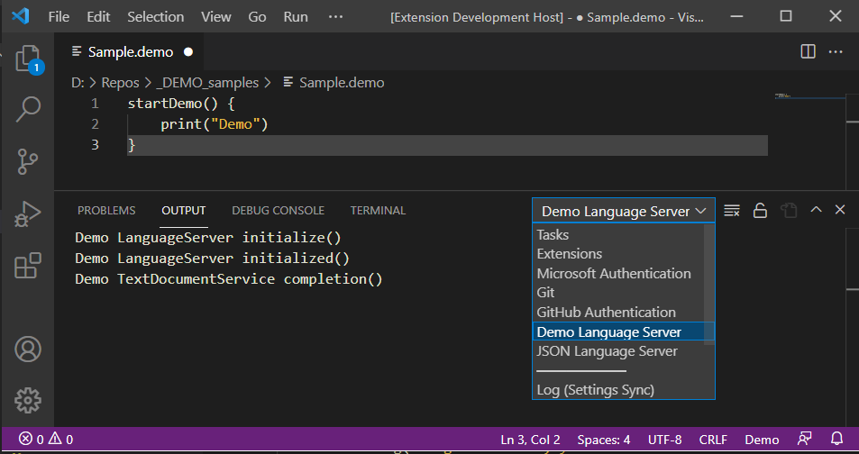

# VsCodeExtensionDemo README

A simple VsCode Extension Demo that profiles basic functionalities.

## Features

### 1. Activation
> CTRL+SHIT+P -> Current Time and Date 

> CTRL+SHIT+P -> Hello World

### 2. Autocomplete Demo

### 3. ClientLogger implementation

## Requirements

## Extension Settings

## Known Issues

## Release Notes

-----------------------------------------------------------------------------------------------------------
