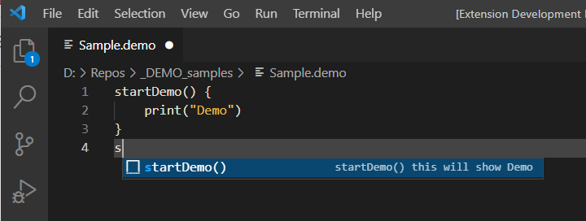

# VsCodeExtensionDemo README

A simple VsCode Extension Demo that profiles basic functionalities.

## Features

CTRL+SHIT+P -> Current Time and Date 
CTRL+SHIT+P -> Hello World

## Requirements

## Extension Settings

## Known Issues

## Release Notes

### 1.0.0

Initial release of ...

-----------------------------------------------------------------------------------------------------------

% cd \VsCodeTraining\VsCodeExtensionDemo
% npm install vscode
- it generates 'node_modules' and makes possible to run/debug the extension
% VsCodeTraining\VsCodeExtensionDemo\node_modules

or just
% npm install

# For VsCode generation
% npm install -g yo generator-code
% yo code

# For VsCode clearing npm cache
rm -rf  node_modules
rm -rf  package-lock.json
% npm cache clean --force

# Configurations for generating java sources from grammer file
* Install and configure antlr V4
https://www.antlr.org/index.html
* Install ANTLR4 grammar syntax support
https://marketplace.visualstudio.com/items?itemName=mike-lischke.vscode-antlr4 
* Check if parser-generation is enabled
https://github.com/mike-lischke/vscode-antlr4/blob/master/doc/parser-generation.md
* In order to generate parser files with ANTLR4 Java must be installed on the system and be executable without an explicit path
(install it via npm install antlr4ts).
% npm install antlr4ts

# Configuration for importing lsp4j and solving dependencies
https://github.com/eclipse/lsp4j/blob/main/Contributing.md#Eclipse
* Install gradle
https://gradle.org/install/
**  Install Buildship plugin, gradle, xtend